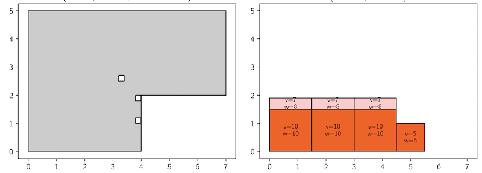
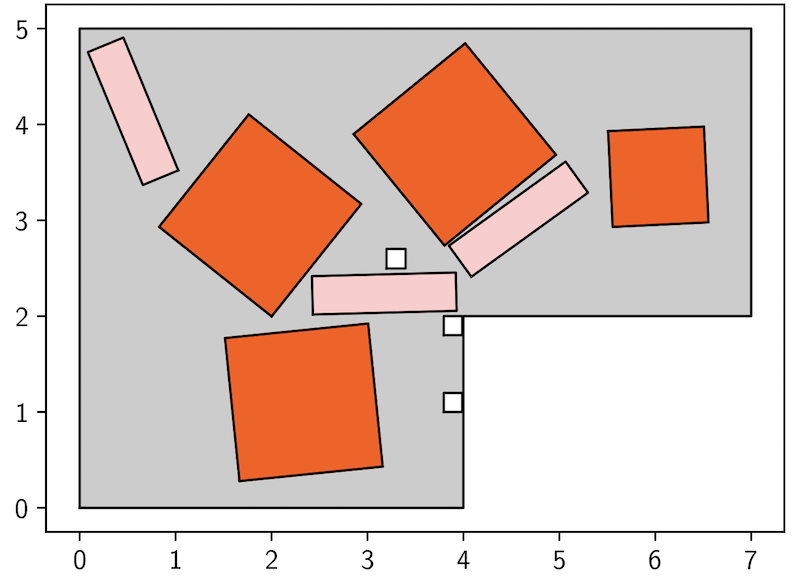
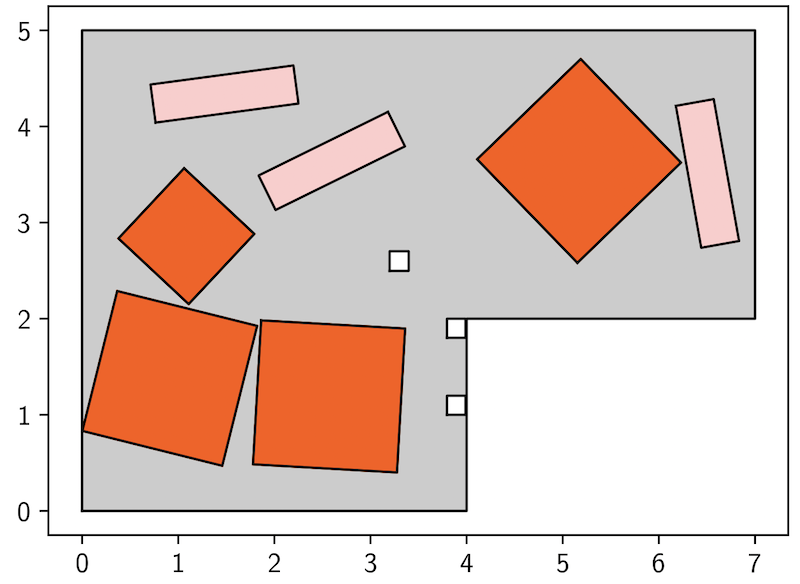
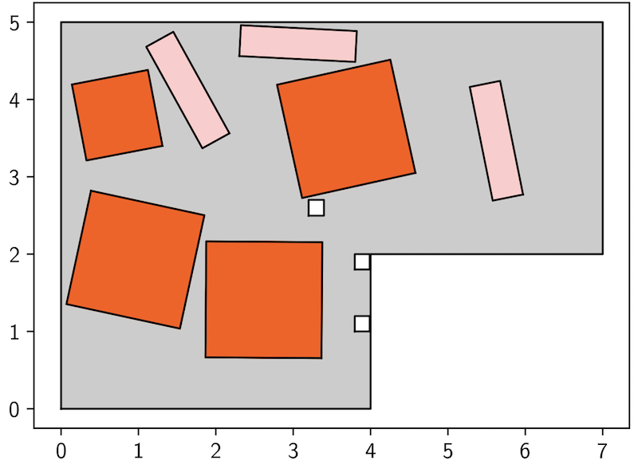

# 遺伝的アルゴリズムによる 拡張２次元ナップサップ/パッキング ソリューション　<!-- omit in toc -->

<div style="display: flex; justify-content: flex-end">©︎d.sugisawa@xander.LLC 19,nov,2023</div>

- [1. 要旨](#1-要旨)
- [2. はじめに](#2-はじめに)
  - [2.1. 首題１：設置不可エリアを回避して 機材を自動で配置](#21-首題１設置不可エリアを回避して-機材を自動で配置)
  - [2.2. 首題2：施行場所クレーン設置候補提案](#22-首題2施行場所クレーン設置候補提案)
- [3. アルゴリズム](#3-アルゴリズム)
- [4. まとめ](#4-まとめ)
- [5. 補遺](#5-補遺)

<div style="page-break-before:always"></div>

# 1. 要旨

パッキング問題と ナップサップ問題とは 双方とも最適化問題であり 
製品の配置や選択に関する ソリューションである，パッキング問題は 設定された範囲（本稿ではポリゴン）に対して異なる形状，サイズの製品を最適に配置する問題・ソリューションである，ナップサップ問題は 同様に設定された容量 に対して 異なる重量の製品を 最適に詰め込む問題・ソリューションである

> パッキング問題，ナップザップ問題は 従来研究 進化的アルゴリズムによる 良いソリューションである 最適化問題である\[1\]

さて 本プロジェクトでは パッキング問題における 容器 ≒ コンテナ：container ポリゴン変数として定義し

```c
max_weight = 100.
container_shape = MultiPolygon([(((0, 0), (0, 5), (7, 5), (7, 2), (4, 2), (4, 0)),
    [((3.2, 2.5), (3.2, 2.7), (3.4, 2.7), (3.4, 2.5)),
    ((3.8, 1.8), (3.8, 2.0), (3.99, 2.0), (3.99, 1.8)),
    ((3.8, 1.0), (3.8, 1.2), (3.99, 1.2), (3.99, 1.0))])])
```

当該 容器 ≒ コンテナ に配置する 製品：機材を アイテム：items ポリゴン変数として定義した


```c
items = [Item(Polygon([(0, 0), (0, 1.5), (1.5, 1.5), (1.5, 0)]), 10., 10.),
    Item(Polygon([(0, 0), (0, 1.5), (1.5, 1.5), (1.5, 0)]), 10., 10.),
    Item(Polygon([(0, 0), (0, 1.5), (1.5, 1.5), (1.5, 0)]), 10., 10.),
    Item(Polygon([(0, 0), (0, 1.), (1., 1.), (1., 0)]), 5., 5.),
    Item(Polygon([(0, 0), (0, 0.4), (1.5, 0.4), (1.5, 0)]), 8., 7.),
    Item(Polygon([(0, 0), (0, 0.4), (1.5, 0.4), (1.5, 0)]), 8., 7.),
    Item(Polygon([(0, 0), (0, 0.4), (1.5, 0.4), (1.5, 0)]), 8., 7.),
]
```



そして コンテナの最大重量制約を 充分に全アイテム容量を含めることができる重量に設定し 幾何学的な重複が発生しないような 配置を 遺伝的アルゴリズムにより ３パターン提供する

||||
|---|---|---|
||||
||||

> ポリゴンの回転角度に制約を設けることによって より実際のソリューションに対し 最適化が可能である

本稿は github にて MITライセンスで 公開されている Albert Esp ́ın Rom ́an 氏 ・スペイン ユニバーシタット・ポリテクニカ・デ・カタルーニャ 大学(Universitat Politècnica de Catalunya) の修士論文で報告されている パッキング問題と ナップサップ問題 の 複合アルゴリズムをベースとした[github.com/dsugisawa-mixi/knapsack-packing](https://github.com/dsugisawa-mixi/knapsack-packing)

<div style="page-break-before:always"></div>

# 2. はじめに

本プロジェクトは 現状の業務システムにおける １種の図形を自動配置するサービスに対する 機能改善のためのソリューションであると 報告を受けている

首題の一つは 設置不可エリアを回避して 機材を自動で配置する候補を３パターンほど 出力することである

そして 首題の二つ目は Googleマップ上に配置すべきクレーンの設置候補場所を レコメンドする仕組みである

## 2.1. 首題１：設置不可エリアを回避して 機材を自動で配置

首題１については 遺伝的アルゴリズムによる ２次元ナップサップ/パッキング にて 概ね実現される

## 2.2. 首題2：施行場所クレーン設置候補提案

首題２ は 首題１を拡張した アルゴリズムが必要である， 最終出力では Googleマップ上に配置すべきクレーンの設置候補場所を レコメンド とある，以降 首題２について考察する

まず，入力データとして 以下が提示されている

+ 道路幅
+ 降ろす機材の重さ
+ 降ろす機材の配置の高さ
+ クレーン設置候補からの距離

このとき 暗黙的に以下が入力値であることを前提として考察をすすめる

> 道路幅が計算可能であり かつ 緯度，経度，高さ制限 が含まれる ポリゴンデータ

一般的な３Dパッキング問題では 機材をZ軸に重ねることができるが 首題２の場合 機材をかさなねることはできないと仮定できる

> つまり 首題２は 拡張２D パッキング問題であり，アルゴリズムの アイテム 配置処理において 高さ制限と 当該ポイントの半径 r 範囲の 重さ制限，そして クレーン設置候補からの距離を パラメータとすることによって 拡張２D パッキング問題に収束することができる

これらのことから 当該プロジェクトを 推進する場合 実業務から 以下のパラメータを算出することによって 首題２のソリューションは実装設計可能であると 考えられる

+ 緯度経度毎の 高さ制限値
+ 緯度経度毎の 重さ制限値
+ クレーン設置候補からの距離制限値

# 3. アルゴリズム

$$
r=RetryCount\equiv10
$$
$$
SelectedPlacements=\max_{i=1}^r\left(EvolutionalyPlacement\left(i\right)\right)
$$

本稿は アルゴリズムの妥当性を 考察するものではないため 簡略な記述にとどめる，当該遺伝的アルゴリズムを シンプルに記述すると 幾何学的に 重ならないように アイテムを配置してみた結果 バリューが 最大なものを選択するものである この時施行回数の途中で 過去試行時の状態によって この配置のまま 処理を進めるか どうかを選択することで 計算回数を少なくなるように調整することを 遺伝的アルゴリズムと呼称される

# 4. まとめ

以上 本稿にて 与えられた 首題１：設置不可エリアを回避して 機材を自動で配置 ，首題2：施行場所クレーン設置候補提案 についてのプレ実装設計 および 特に 首題２に関しての 実装可能性を示した

そのうえで  緯度経度毎の 高さ制限，重さ制限 のパラメータ定義は 実ソリューションにおける 定義として 法令，および 業界慣習をふまえ ソースとして 比較的明示的になっていないことが 想定される，よって 本ソリューションで 重要なのは 緯度経度毎の 高さ制限，重さ制限 のパラメータ定義 であると考えている

# 5. 補遺

本稿では アルゴリズム，パラメータの妥当性に関する 考察・検証は実施せず 最終出力が どのようになり，そして システム更改が可能か，否かについて 記述するものとした

アルゴリズムの詳細については 小職が参考とした github リポジトリの Albert Esp ́ın Rom ́an 氏 による[修士論文](https://github.com/albert-espin/knapsack-packing/blob/master/Report.pdf) を参照されたい
